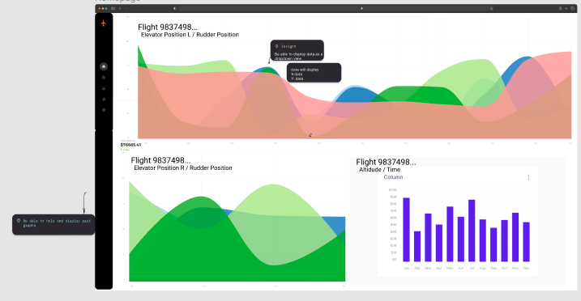

# CS178A-B-Template

## Table of Contents
- [Overview](#overview)
- [Usage](#usage)
- [How To Run](#how-to-run)
- [Diagrams](#diagrams)
- [Dependencies](#dependencies)
- [Authors and Acknowledgment](#authors-and-acknowledgment)
- [Project Status](#project-status)

## Overview
Researchers would like to identify trends (specifically anomalies) in flight data and be able to label it as such and export it to a separate database.

The goal of this project is to create a web application with an easy to use U.I that is fast that will allow researchers to view the data with filters and allow them to spot and label anomalies. 

Noticing and marking anomalous data is extremely important in determining any failures in both the pilot and the plane that was in the flight. It helps expose trends that may be a risk to flight safety.

## Team

<a href="https://github.com/Zycron83" target="_blank">Jeremy Cartwright </a>

<a href="https://github.com/achhi002" target="_blank">Adhikar Chhibber </a>

<a href="https://github.com/isis52300" target="_blank">Isis Dumas </a>

<a href="https://github.com/dguti026" target="_blank">David Gutierrez </a>

## Usage
Demo: <Link to youtube video>

<Screenshot of application>

TBD

## How To Run
Ensure the dependencies are met.
Then in the project directory, you can run: `node Server.js`

This will begin the server. Once the server is running, open `Client.html`. The application is now usable.

## Diagrams

Mockup of Data: 
  

  

  

  

## Dependencies
Install NodeJS. Ensure the version is 16. You can install directly from their website [here](https://nodejs.org/en/). 
Install Node Package Manager (npm). Usually comes with NodeJS.
Install the CSV-Parse package with the command `npm i csv` in the project directory.

## Authors and Acknowledgment
Thank you to Professor Mariam Salloum and our Teaching Assistants, Jakapun Tachaiya and Shirin Haji Amin Shirazi, for all of their assistance throughout this process. We would also like to thank NASA for giving us this opportunity to work on a project for them. 

## Project Status
Most of the project is completed, but we plan to continue working on it to add additional features. 

