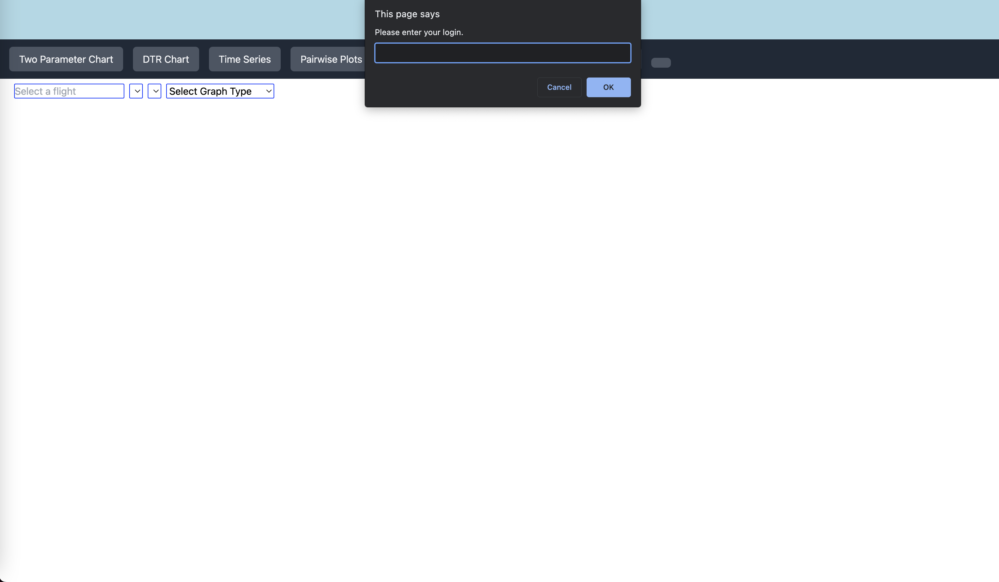
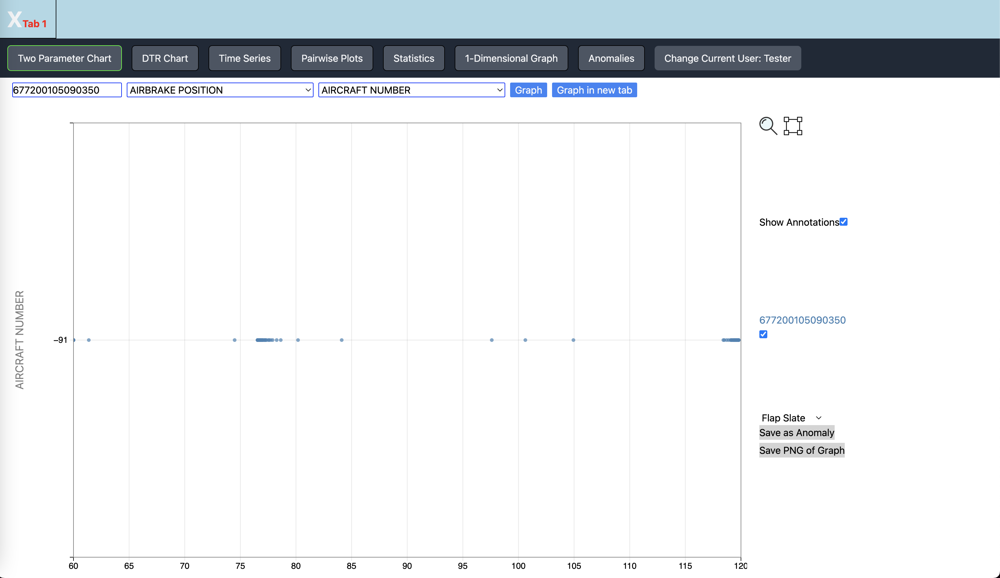
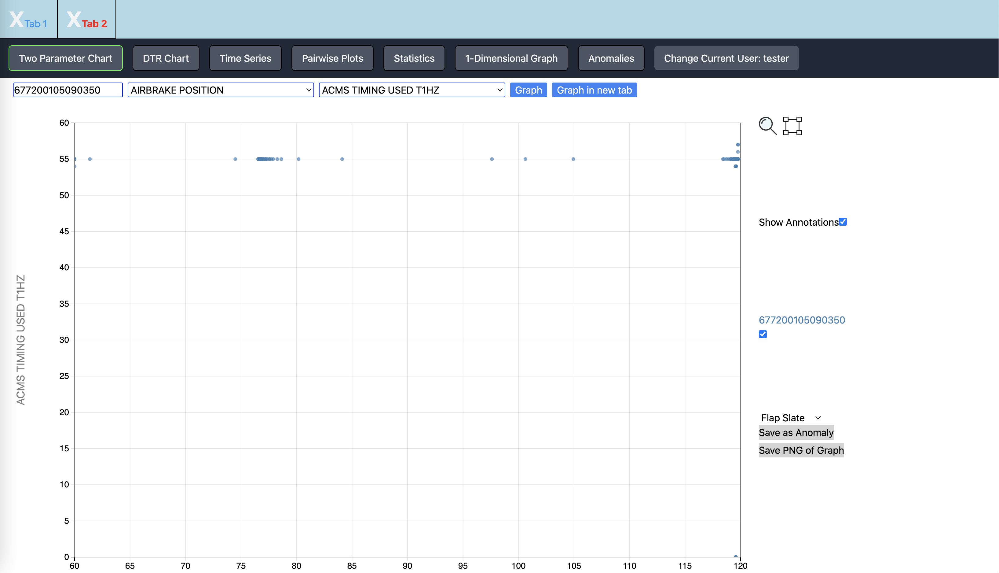
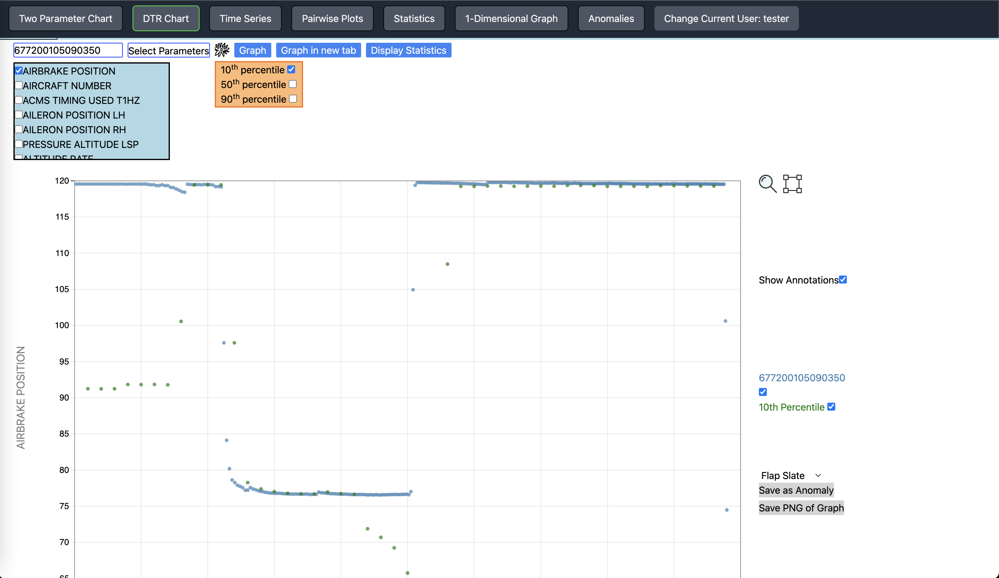
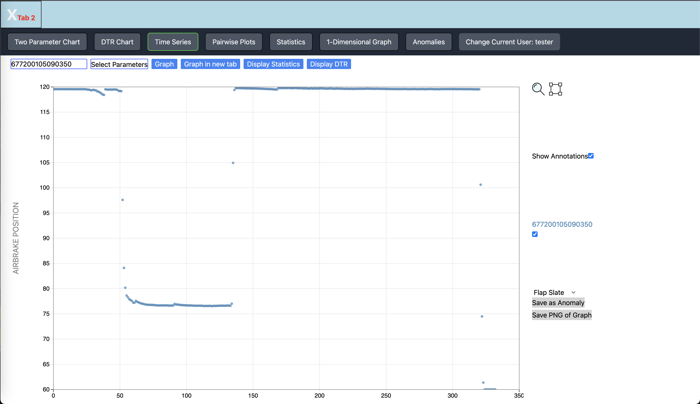
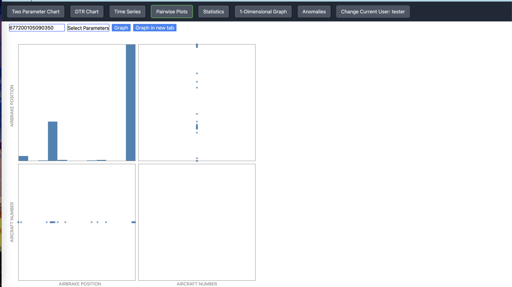
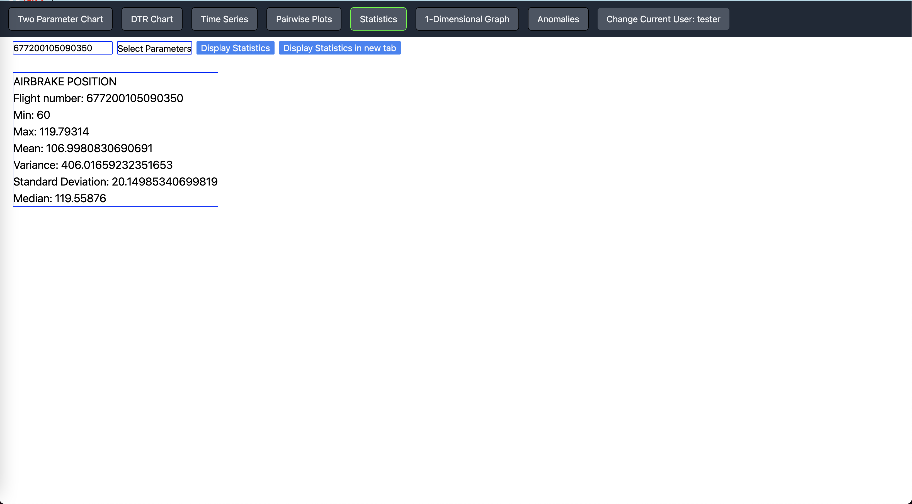
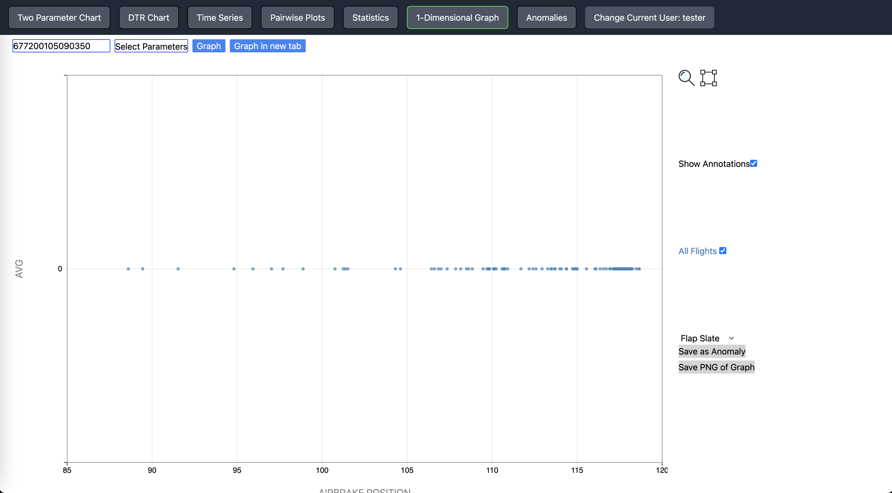
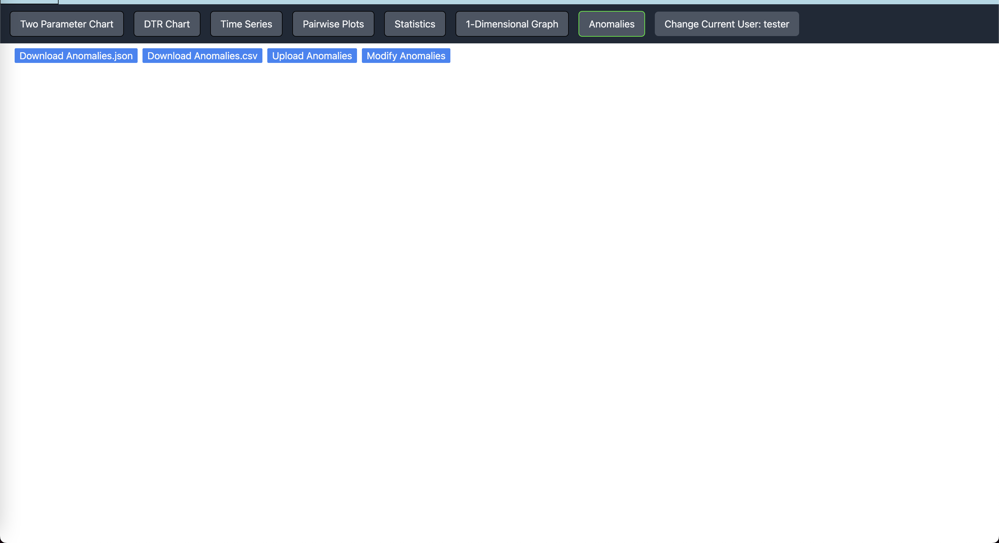
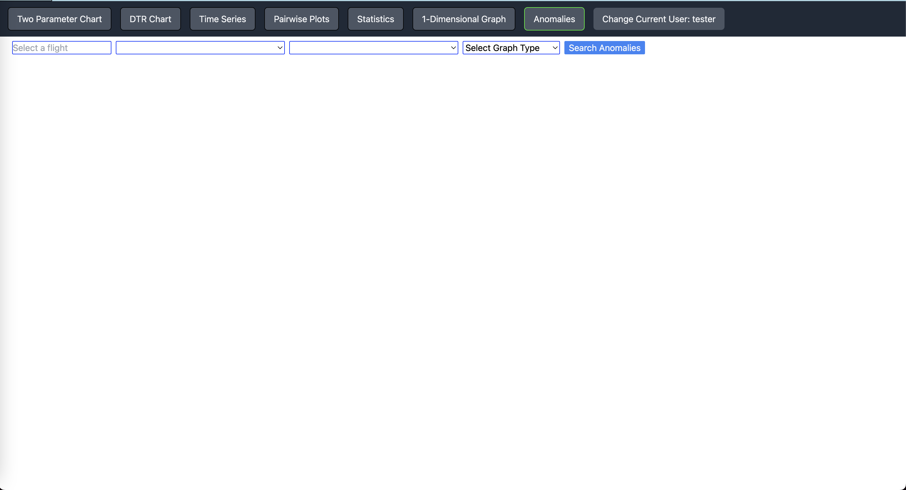

[](https://classroom.github.com/online_ide?assignment_repo_id=5827477&assignment_repo_type=AssignmentRepo)
# CS178A-B-Template

## Table of Contents
- [Overview](#overview)
- [How To Run](#how-to-run)
- [Usage](#usage)
- [Dependencies](#dependencies)
- [Authors and Acknowledgment](#authors-and-acknowledgment)


## Overview
Researchers would like to identify trends (specifically anomalies) in flight data and be able to label it as such and export it to a separate database.

The goal of this project is to create a web application with an easy to use U.I that is fast that will allow researchers to view the data with filters and allow them to spot and label anomalies. 

Noticing and marking anomalous data is extremely important in determining any failures in both the pilot and the plane that was in the flight. It helps expose trends that may be a risk to flight safety.

## Team

<a href="https://github.com/Zycron83" target="_blank">Jeremy Cartwright </a>

<a href="https://github.com/achhi002" target="_blank">Adhikar Chhibber </a>

<a href="https://github.com/isis52300" target="_blank">Isis Dumas </a>

<a href="https://github.com/dguti026" target="_blank">David Gutierrez </a>

## How To Run
Ensure the dependencies are met.
Then in the project directory, you can run: 
```
node Server.js
```
This will begin the server. Once the server is running, open `Client.html`. The application is now usable.

If new flights are added to the flights folder, then run the following commands:

```
node truncate_csvs_to_json.js
```
```
node calculate_percentiles.js
```
```
node calculate_aggregates.mjs
```
Now run the following command:
```
node Server.js
```
This will begin the server. Once the server is running, open `Client.html`. The application is now usable.

## Usage
Once you have the server running and are in `Client.html`, you will see the following home screen: 



If you have used the application before then you will not see the login prompt. 

If this is your first time using the application, then enter your username. This will be saved for future uses. 

Here, choose the desired graph type to display by pressing one of the buttons at the top of the screen or if you wish to change your username, then click the `Change Current User` button on the top right to change your login, this change will apply to future uses. 

Use the drop down bars to choose the desiered flight and parameters. The graph will display once the `Graph` button is pressed.    

For the `Two Parameter Chart`, if two different parameters are chosen, a scatter plot will be shown:



To have more than one graph be displayed, press the `Graph in New Tab` button:



This feature allows the switching between multiple graphs that have been created. This works for all graph types. 

For the `DTR chart`, along with the flowing graphing options, the drop down bar will display a checkbox with all of the parameters. Choose the desired parameters to produce a graph. Pressing the gear next to the Graph button will display another checkbox. This gives the option to choose between the `10th, 50th, and 90th percentiles` of the desired flight and parameters. As few or as many percentile options can be chosen and displayed:



> **_NOTE:_** Using the percentiles feature will create an entirely new graph. It is NOT possible to add the percentiles to the graph displayed in the current tab. To add the percentile lines to the current tab, the flight and perameter drop downs would have to be set to the same values as the graph in the tab.

The `Time Series` charts work in a similar way as the DTR charts. Choose the flight and the parameters in their respective drop downs to display the results:



Before graphing, click `Display Statistics` to show the statistics for the flight and parameters chosen. Note this will wipe the graphs currently displayed on that tab.

After graphing, click `Display DTR` to show the DTR Chart for the flight and parameters chosen. Note this will wipe the graphs currently displayed on that tab.

For the `Pairwise Plots`, a minimum of 2 parameters must be chosen. 

For example, if 2 parameters are chosen, 4 graphs are displayed as shown:




To display the statistics of certain parameters, choose the desired flight and parameters, then press the `Statistics` button as shown:



The stats that will be displayed are the `Minimum, Maximum, Mean, Varience, Standard Deviation, and Median` of each chosen parameter, along with the flight number they coorespond to. 

The stats will display a in a different tab from the graphs themselves. This can be done from any of the previous graph windows mentioned. 

> **_NOTE:_** Similar to the percentiles feature, the stats shown will be for the flight and parameters chosen in their respectice drop down bars, NOT the graph displayed in the tab. If you want the stats for the graph displayed,  the same flight and parameters of the graph in the tab has to be set before pressing the Statistics button.

To display a 1-Dimension chart of the average, select the `1-Dimensional Graph` on the top. This graph type works similar to the Time Series graph type.



Once a desired graph has been created, it can be zoomed into at certain locations by holding down the mouse and dragging a box around the desired area. 

Anomalies in the graph are able to be marked as well. Once they are, the points on the graph marked will change colors based on the desired color selection. 

To mark an anomaly, click the 4-square icon next to the magnifying glass. Then drag your cursor over the area in the graph that you wish to mark. Then select the anomaly type on the dropdown next to the graph then select `Save as Anomaly`. This will update the graph to reflect the anomaly and future times where this graph appears, the anomaly will be marked as well. 

To save the graph as a png, select the `Save PNG of graph` option next to the graph.

Select the anomaly button on the top to either modify an anomaly or to download the anomaly list as a JSON or a CSV file.

You may also uplaod your own anomaly list as well in CSV or JSON format as well.



> **_NOTE:_** When uploading anomalies of either JSON or CSV format, ensure that your file follows the format of the JSON or CSV file used in the program. If the file does not follow the same format then the program may experience errors.

To change an anomaly, select `Modify Anomalies`. Then select the filters to apply and search for the anomaly you wish to modify. Select the anomaly and a graph with the anomaly will be displayed. Then you may normally modify it by simply using the previous steps to mark an anomaly. The graph will update to show the change. If you wish to modify the new anomaly, then redo the search and restart the process of marking an anomaly.



## Dependencies
Install NodeJS. Ensure the version is 16. You can install directly from their website [here](https://nodejs.org/en/). 
Install Node Package Manager (npm). Usually comes with NodeJS.

Install the CSV-Parse package with the command `npm i csv` in the project directory.

Install the json2csv package with the command `npm i json2csv` in the project directory.

Install the csv-writer package with the command `npm i csv-writer` in the project directory.

Install the csv-append packpage with the command `npm i csv-append` in the project directory. 

Install the csv-stringify package with the command `npm i csv-stringify` in the project directory.

All packages should be installed in the node_modules folder. Run these commands in the case that these packages are not present.

## Authors and Acknowledgment
Thank you to Professor Mariam Salloum and our Teaching Assistants, Jakapun Tachaiya and Shirin Haji Amin Shirazi, for all of their assistance throughout this process. We would also like to thank NASA for giving us this opportunity to work on a project for them. 


